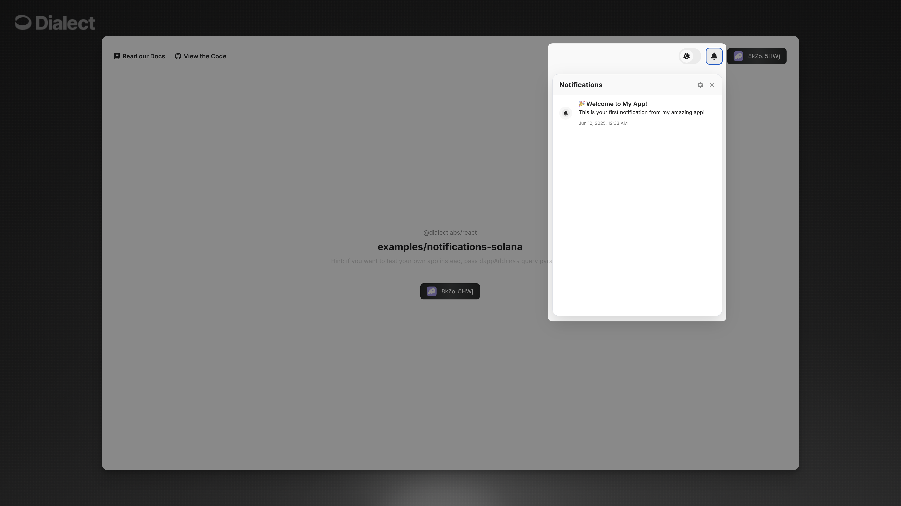

# Introduction

Integrate notification inboxes into your React applications to let users view, manage, and interact with their notifications. The React SDK provides two components designed for different use cases and customization needs.

## Getting Started

Follow this recommended flow:

1. **[Setup & Configuration](./setup-configuration.md)** - Install packages and configure the Dialect SDK client
2. **[User Management](../user-management.md)** - Understand subscriptions, channels, and topics before implementing components
3. **Choose your component:** 
   - **[NotificationsButton](./notifications-button.md)** - Complete done-for-you solution with limited customization
   - **[Notifications](./notifications.md)** - Standalone component with full styling control

