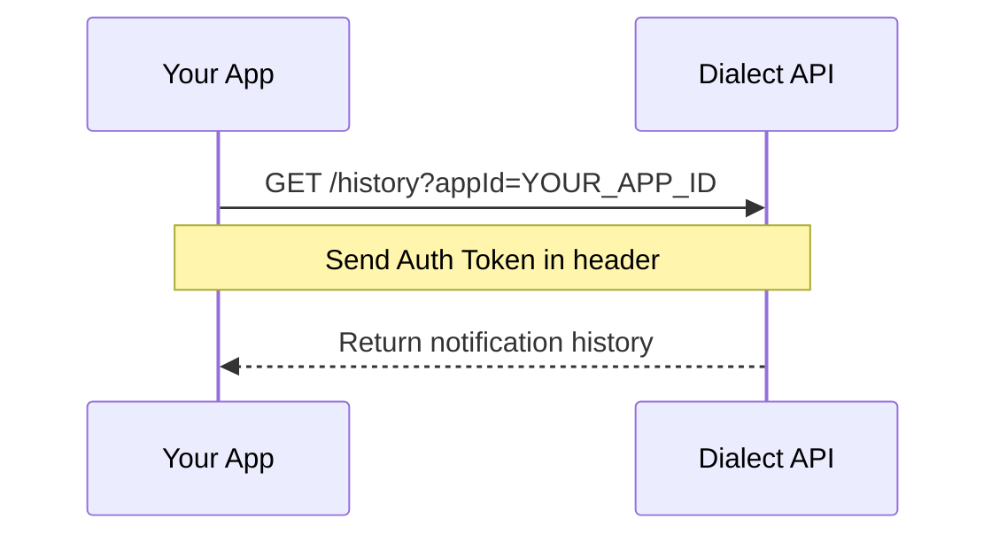

# Manage Notification History

This section explains how to retrieve and manage notification history for your users. Once users are authenticated and have subscribed to notifications, they can access their message history and mark messages as read.

## Authentication

These endpoints require authentication with a user's Bearer token, which is obtained through the [authentication process](./receive-push-notifications.mdx#get-auth-token).

```shell
Authorization: Bearer YOUR_AUTH_TOKEN
```

## Get Notification History

You can retrieve a user's notification history, including both read and unread messages:



```shell
curl https://alerts-api.dial.to/v2/history?appId=YOUR_APP_ID \
  --request GET \
  --header 'Authorization: Bearer YOUR_AUTH_TOKEN'
```

**Parameters:**

- `⁠appId`: Your application's unique identifier (provided by Dialect)
- `⁠limit`: (Optional) Number of notifications to return (default: 25, max: 50)
- `⁠cursor`: (Optional) Pagination cursor for fetching more results

The response will contain a list of notifications and summary information:

```shell
{
  "alerts": [
    {
      "id": "01897d5b-48b5-7b68-94e4-2fa8377a5f78",
      "timestamp": "2024-02-20T15:30:00.000Z",
      "title": "New Message",
      "body": "You have received a new message",
      "image": "https://www.dialect.to/favicon.ico",
      "actions": [
        {
          "type": "link",
          "label": "Open Message",
          "url": "https://dialect.to/message"
        }
      ],
      "topic": {
        "id": "123e4567-e89b-12d3-a456-426614174000",
        "name": "Announcements"
      }
    }
  ],
  "summary": {
    "unreadCount": 5,
    "lastRead": {
      "timestamp": "2024-02-20T15:30:00.000Z"
    }
  },
  "limit": 25,
  "cursor": "base64encodedcursor"
}
```

If you want to test the endpoint, visit the [`/history`](https://alerts-api.dial.to/docs#tag/subscriber/GET/v2/history) endpoint in our API docs.

## Get History Summary

To get a quick summary of a user's notification status without retrieving the full history, use the summary endpoint:

```shell
curl https://alerts-api.dial.to/v2/history/summary?appId=YOUR_APP_ID \
  --request GET \
  --header 'Authorization: Bearer YOUR_AUTH_TOKEN'
```

**Parameters:**

- `⁠appId`: Your application's unique identifier (provided by Dialect)

The response will contain a summary of the user's notification status:

```shell
{
  "unreadCount": 5,
  "lastRead": {
    "timestamp": "2024-02-20T15:30:00.000Z"
  }
}
```

If you want to test the endpoint, visit the [`/history/summary`](https://alerts-api.dial.to/docs#tag/subscriber/GET/v2/history/summary) endpoint in our API docs.

## Mark Notifications as Read

After a user views their notifications, you can mark them as read:

```shell
curl https://alerts-api.dial.to/v2/history/read \
  --request POST \
  --header 'Authorization: Bearer YOUR_AUTH_TOKEN' \
  --header 'Content-Type: application/json' \
  --data '{
    "appId": "YOUR_APP_ID"
  }'
```

**Parameters:**

- `⁠appId`: Your application's unique identifier (provided by Dialect)

The response will be an empty JSON object indicating success:

```shell
{}
```

If you want to test the endpoint, visit the [`/history/read`](https://alerts-api.dial.to/docs#tag/subscriber/POST/v2/history/read) endpoint in our API docs. 