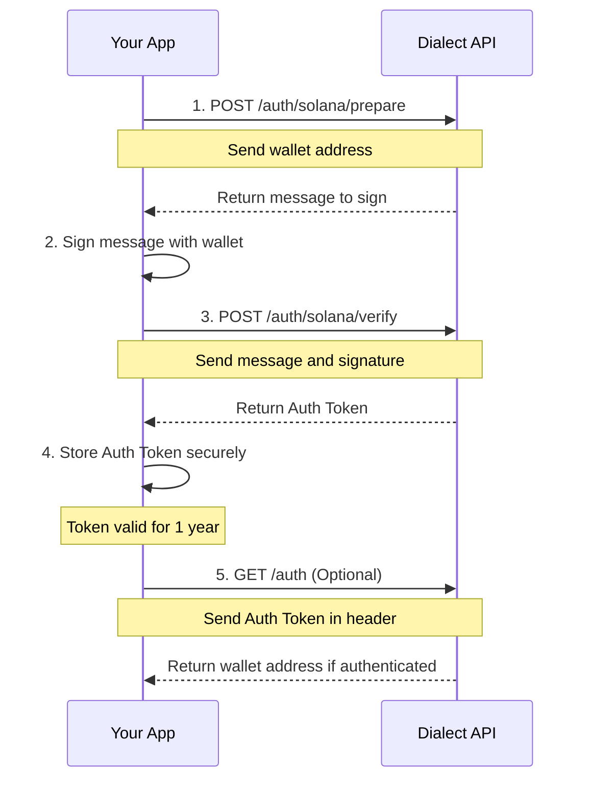
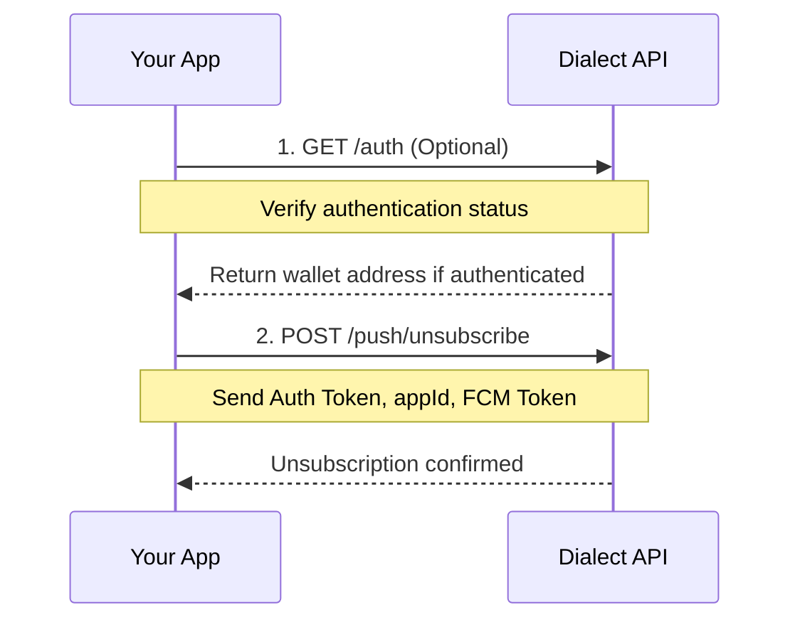

# Receive Push Notifications

In this section, you will learn how you can implement push notifications in your application using Dialect's push notification API. Push notifications allow your application to notify users about important events even when they're not actively using your application.

## Authentication Flow

This is the first step and required to receive a `Bearer` token, which is used to authenticate the user with Dialect's APIs and manage the user's subscription. The authentication process uses the [Sign-in with Solana (SIWS)](https://github.com/phantom/sign-in-with-solana) flow, which forces users to sign a message with their wallet to prove ownership and login to your application.



### 1. Request a message to sign

First, request a message containing a nonce (a one-time value) that the user will sign:

```shell
curl https://alerts-api.dial.to/v2/auth/solana/prepare \
  --request POST \
  --header 'Content-Type: application/json' \
  --data '{
  "walletAddress": "YOUR_WALLET_ADDRESS"
}'
```

The response will contain a message with a nonce:

```shell
{
  "message": "Sign this message to authenticate. Nonce: 1638471298347"
}
```

If you want to test the endpoints, visit the [`/prepare`](https://alerts-api.dial.to/docs#tag/subscriber/POST/v2/auth/solana/prepare) endpoint in our API docs.

### 2. Sign the message

In this step, the user has to sign this message with their Solana wallet. The exact implementation depends on which wallet provider you're using, but typically involves calling a `⁠signMessage` method. You can find a [sign and verify message](https://solana.com/developers/cookbook/wallets/sign-message) example in the [Solana Cookbook](https://solana.com/developers/cookbook).

### 3. Verify the signature

After obtaining the signature, send it back to the server for verification:

```shell
curl https://alerts-api.dial.to/v2/auth/solana/verify \
 --request POST \
 --header 'Content-Type: application/json' \
 --data '{
   "message": "Sign this message to authenticate. Nonce: 1638471298347",
   "signature": "WALLET_SIGNATURE"
}'
```

If verification was successful, the server will return an authentication token:

```shell
{
   "token": "YOUR_AUTH_TOKEN",
   "subscriber": {
      "walletAddress": "YOUR_WALLET_ADDRESS"
   }
}
```

This token should be stored securely and used for the API calls that require authentication.

If you want to test the endpoints, visit the [`/verify`](https://alerts-api.dial.to/docs#tag/subscriber/POST/v2/auth/solana/verify) endpoint in our API docs.

### 4. Check status (optional)

To ensure that a user is authenticated and can receive notifications, you can use the `/auth` endpoint.

```shell
curl https://alerts-api.dial.to/v2/auth \
  --request GET \
  --header 'Authorization: Bearer YOUR_AUTH_TOKEN'
```

This endpoint will either return a 401 error, if user is unauthenticated or the wallet address if authentication was successful.

```shell
{
  "walletAddress": "6CxnSjtasq5Tzwb4b93AhLofXtiDvMpQ2vTkWdSZqTH7"
}
```

If you want to test the endpoints, visit the [`/auth`](https://alerts-api.dial.to/docs#tag/subscriber/GET/v2/auth) endpoint in our API docs.

## Subscribe to Push Notifications

Once a user is authenticated, you can register their device to receive push notifications. To register a device for push notifications, call the subscribe endpoint with the device information.

:::tip
Subscribe on app start and when adding new wallets.
:::


```shell
curl https://alerts-api.dial.to/v2/push/subscribe \
 --request POST \
 --header 'Authorization: Bearer YOUR_AUTH_TOKEN' \
 --header 'Content-Type: application/json' \
 --data '{
   "appId": "YOUR_APP_ID",
   "deviceId": "UNIQUE_DEVICE_ID",
   "fcmToken": "FIREBASE_FCM_TOKEN"
}'
```

**Parameters:**

- `⁠appId`: Your application's unique identifier (provided by Dialect)
- `⁠deviceId`: (Optional) Identifier for the user's device
- `⁠fcmToken`: Firebase Cloud Messaging token from the [FCM SDK](https://firebase.google.com/docs/cloud-messaging)

The subscription process associates the user's wallet address with their device, allowing your application to send targeted push notifications to this specific device.

If you want to test the endpoints, visit the [`/subscribe`](https://alerts-api.dial.to/docs#tag/subscriber/POST/v2/push/subscribe) endpoint in our API docs.

## Unsubscribe from Push Notifications

The unsubscribe endpoint allows you to remove a device from the notification system.

:::tip
Always use unsubscribe when removing wallets from app.
:::



```shell
curl https://alerts-api.dial.to/v2/push/unsubscribe \
 --request POST \
 --header 'Authorization: Bearer YOUR_AUTH_TOKEN' \
 --header 'Content-Type: application/json' \
 --data '{
   "appId": "YOUR_APP_ID",
   "deviceId": "UNIQUE_DEVICE_ID",
   "fcmToken": "FIREBASE_FCM_TOKEN"
}'
```

The unsubscribe endpoint requires the same parameters as the subscribe endpoint:

- `⁠appId`: Your application's unique identifier (provided by Dialect)
- `⁠deviceId`: (Optional) Identifier for the user's device
- `⁠fcmToken`: Firebase Cloud Messaging token from the [FCM SDK](https://firebase.google.com/docs/cloud-messaging)

After unsubscribing, the device will no longer receive push notifications from your application.

If you want to test the endpoints, visit the [`/unsubscribe`](https://alerts-api.dial.to/docs#tag/subscriber/POST/v2/push/unsubscribe) endpoint in our API docs.
