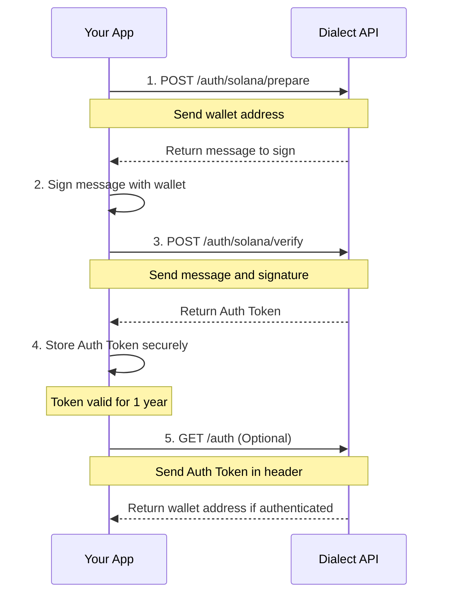
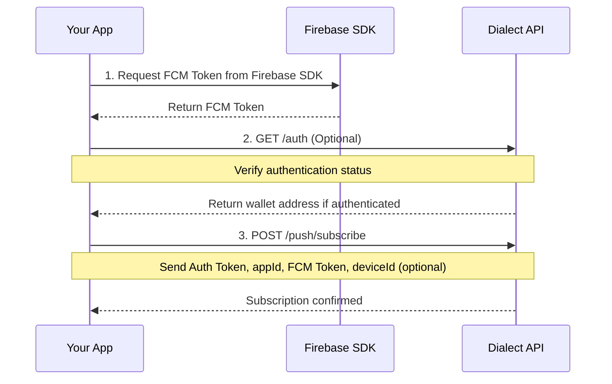
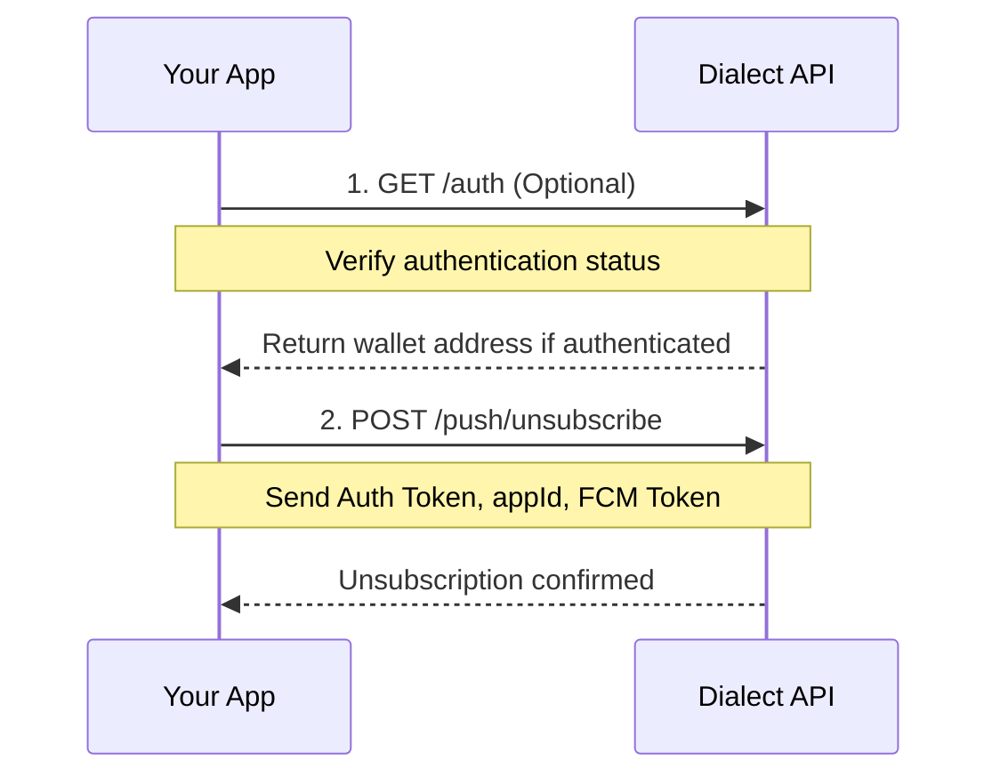

import PlatformCodeTabs from "@site/src/components/PlatformCodeTabs";
import { androidCode, iosCode, webCode } from "@site/src/code-examples/fcmCodeSnippets";

# Receive Push Notifications

In this section, you will learn how you can implement push notifications in your application using Dialect's push
notification API. Push notifications allow your application to notify users about important events even when they're not
actively using your application.

## Prerequisites

Before implementing push notifications with Dialect:

1. **Set up Firebase Cloud Messaging** in your application

   - Follow [Firebase's documentation](https://firebase.google.com/docs/cloud-messaging) to add the Firebase SDK to your
     app
   - Implement the necessary code to [request and receive an FCM token](#1-obtain-firebase-cloud-messaging-fcm-token)

2. **Implement wallet integration** for Solana signature verification
   - Your app must be able to request message signing from the user's wallet

Once these prerequisites are in place, you can proceed with the authentication and subscription flows.

## Get Auth Token

This is the first step and required to receive a `Bearer` token, which is used to authenticate the user with Dialect's
APIs and manage the user's subscription. The authentication process uses a message format that is similar to
[Sign-in with Solana (SIWS)](https://github.com/phantom/sign-in-with-solana), which forces users to sign a message
with their wallet to prove ownership and login to your application.



### 1. Request a message to sign

First, request a message containing a nonce (a one-time value) that the user will sign:

```shell
curl https://alerts-api.dial.to/v2/auth/solana/prepare \
  --request POST \
  --header 'Content-Type: application/json' \
  --header 'X-Dialect-Client-Key: YOUR_CLIENT_KEY' \
  --data '{
  "walletAddress": "YOUR_WALLET_ADDRESS"
}'
```

The response will contain a message with a nonce:

```shell
{
  "message": "Sign this message to authenticate. Nonce: 1638471298347"
}
```

If you want to test the endpoints, visit the
[`/prepare`](https://alerts-api.dial.to/docs#tag/subscriber/POST/v2/auth/solana/prepare) endpoint in our API docs.

### 2. Sign the message

In this step, the user has to sign this message with their Solana wallet. The exact implementation depends on which
wallet provider you're using, but typically involves calling a `⁠signMessage` method. You can find a
[sign and verify message](https://solana.com/developers/cookbook/wallets/sign-message) example in the
[Solana Cookbook](https://solana.com/developers/cookbook).

### 3. Verify the signature

After obtaining the signature, send it back to the server for verification:

```shell
curl https://alerts-api.dial.to/v2/auth/solana/verify \
 --request POST \
 --header 'Content-Type: application/json' \
 --header 'X-Dialect-Client-Key: YOUR_CLIENT_KEY' \
 --data '{
   "message": "Sign this message to authenticate. Nonce: 1638471298347",
   "signature": "WALLET_SIGNATURE"
}'
```

If verification was successful, the server will return an authentication token:

```shell
{
   "token": "YOUR_AUTH_TOKEN",
   "subscriber": {
      "walletAddress": "YOUR_WALLET_ADDRESS"
   }
}
```

This token should be stored securely and used for the API calls that require authentication.

If you want to test the endpoints, visit the
[`/verify`](https://alerts-api.dial.to/docs#tag/subscriber/POST/v2/auth/solana/verify) endpoint in our API docs.

### 4. Check status (optional)

To ensure that a user is authenticated and can receive notifications, you can use the `/auth` endpoint.

```shell
curl https://alerts-api.dial.to/v2/auth \
  --request GET \
  --header 'Authorization: Bearer YOUR_AUTH_TOKEN' \
  --header 'X-Dialect-Client-Key: YOUR_CLIENT_KEY'
```

This endpoint will either return a 401 error, if user is unauthenticated or the wallet address if authentication was
successful.

```shell
{
  "walletAddress": "6CxnSjtasq5Tzwb4b93AhLofXtiDvMpQ2vTkWdSZqTH7"
}
```

If you want to test the endpoints, visit the [`/auth`](https://alerts-api.dial.to/docs#tag/subscriber/GET/v2/auth)
endpoint in our API docs.

## Subscribe to In-App Alerts

In addition to push notifications, users can also subscribe to receive in-app alerts through your application:

```shell
curl https://alerts-api.dial.to/v2/subscribe \
  --request POST \
  --header 'Authorization: Bearer YOUR_AUTH_TOKEN' \
  --header 'X-Dialect-Client-Key: YOUR_CLIENT_KEY' \
  --header 'Content-Type: application/json' \
  --data '{
    "appId": "YOUR_APP_ID"
  }'
```

**Parameters:**

- `⁠appId`: Your application's unique identifier (provided by Dialect)

The response will be an empty JSON object indicating success:

```shell
{}
```

If you want to test the endpoint, visit the [`/subscribe`](https://alerts-api.dial.to/docs#tag/subscriber/POST/v2/subscribe) endpoint in our API docs.

## Subscribe to Push Notifications

:::tip
We recommend to subscribe for push notifications on app start and when adding new wallets.
:::

Once a user is authenticated, you can register their device to receive push notifications. This involves obtaining an FCM token and associating it with the user's wallet address via our subscribe endpoint.



### 1. Obtain Firebase Cloud Messaging (FCM) Token

Before you can subscribe to push notifications, you need to obtain an FCM token from Firebase.

<PlatformCodeTabs androidCode={androidCode} iosCode={iosCode} webCode={webCode} />

For more detailed implementation instructions please visit the [Firebase Cloud Messaging documentation](https://firebase.google.com/docs/cloud-messaging) for [iOS](https://firebase.google.com/docs/cloud-messaging/ios/client), [Android](https://firebase.google.com/docs/cloud-messaging/android/client) and [Web](https://firebase.google.com/docs/cloud-messaging/js/client).

### 2. Verify Authentication (Optional)

Before subscribing, you can optionally verify that the user is properly [authenticated](#4-check-status-optional).

### 3. Subscribe to Notifications

```shell
curl https://alerts-api.dial.to/v2/push/subscribe \
 --request POST \
 --header 'Authorization: Bearer YOUR_AUTH_TOKEN' \
 --header 'X-Dialect-Client-Key: YOUR_CLIENT_KEY' \
 --header 'Content-Type: application/json' \
 --data '{
   "appId": "YOUR_APP_ID",
   "deviceId": "UNIQUE_DEVICE_ID",
   "fcmToken": "FIREBASE_FCM_TOKEN"
}'
```

**Parameters:**

- `appId`: (Optional) Your application's unique identifier. When not specified, you must include the X-Dialect-Client-Key header.
- `deviceId`: (Optional) Identifier for the user's device
- `fcmToken`: Firebase Cloud Messaging token from the [FCM SDK](https://firebase.google.com/docs/cloud-messaging)

:::caution Important Notes
- If you do not specify an `appId`, you MUST include the `X-Dialect-Client-Key` header to identify your client application.
- We recommend always including the `X-Dialect-Client-Key` header in all API calls.
- You can request a client key from Dialect if you don't have one.
::: 

The subscription process associates the user's wallet address with their device, allowing your application to send
targeted push notifications to this specific device.

The response will be an empty JSON object indicating success:

```shell
{}
```

If you want to test the endpoint, visit the [`/subscribe`](https://alerts-api.dial.to/docs#tag/subscriber/POST/v2/subscribe) endpoint in our API docs.


## Unsubscribe from Push Notifications

The unsubscribe endpoint allows you to remove a device from the notification system.

:::tip
Always use unsubscribe when removing wallets from app.
:::



```shell
curl https://alerts-api.dial.to/v2/push/unsubscribe \
 --request POST \
 --header 'Authorization: Bearer YOUR_AUTH_TOKEN' \
 --header 'X-Dialect-Client-Key: YOUR_CLIENT_KEY' \
 --header 'Content-Type: application/json' \
 --data '{
   "appId": "YOUR_APP_ID",
   "deviceId": "UNIQUE_DEVICE_ID",
   "fcmToken": "FIREBASE_FCM_TOKEN"
}'
```

The unsubscribe endpoint requires the same parameters as the subscribe endpoint:

- `appId`: (Optional) Your application's unique identifier. When not specified, you must include the X-Dialect-Client-Key header.
- `deviceId`: (Optional) Identifier for the user's device
- `fcmToken`: Firebase Cloud Messaging token from the [FCM SDK](https://firebase.google.com/docs/cloud-messaging)

:::caution Important Notes
- If you do not specify an `appId`, you MUST include the `X-Dialect-Client-Key` header to identify your client application.
- We recommend always including the `X-Dialect-Client-Key` header in all API calls.
- You can request a client key from Dialect if you don't have one.
::: 

After unsubscribing, the device will no longer receive push notifications from your application.

The response will be an empty JSON object indicating success:

```shell
{}
```

If you want to test the endpoints, visit the
[`/unsubscribe`](https://alerts-api.dial.to/docs#tag/subscriber/POST/v2/push/unsubscribe) endpoint in our API docs.

## Access Notification History

Once a user is authenticated and subscribed to notifications, they can access their notification history and mark messages as read. 

For more information on retrieving and managing notification history, see the [Notification History](./notification-history.md) documentation.