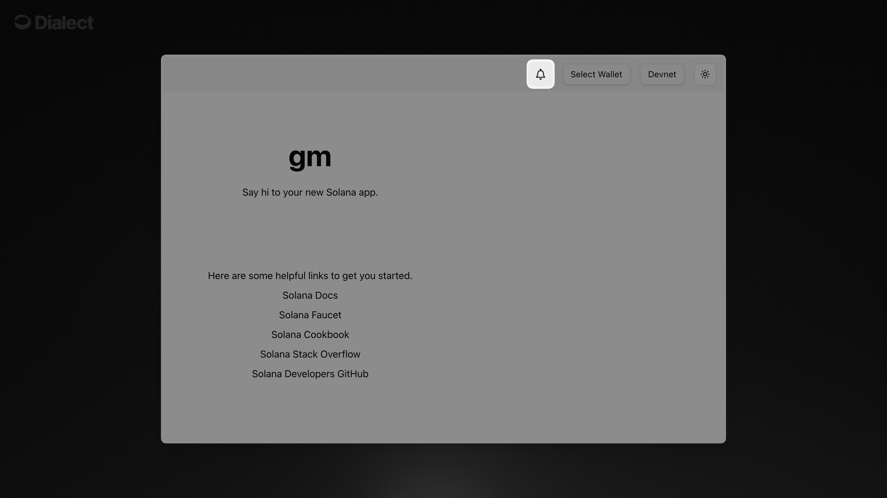

import Tabs from '@theme/Tabs';
import TabItem from '@theme/TabItem';
import YouTubeVideo from '@site/src/components/YouTubeVideo';


# Quick Start

Get your first notification working in under 15 minutes. This guide walks you through the complete flow from dashboard registration to sending your first notification to a user's wallet.

## Video Tutorial
Watch the complete walkthrough to see exactly how it works.

<YouTubeVideo videoId="aPLaXqEkzJY" />


### Chapters
- [00:00](https://youtu.be/aPLaXqEkzJY?t=0) Send your first alert in 15 minutes
- [00:25](https://youtu.be/aPLaXqEkzJY?t=25) Prerequisites
- [03:13](https://youtu.be/aPLaXqEkzJY?t=193) Register your app
- [05:37](https://youtu.be/aPLaXqEkzJY?t=337) Setup a clean project
- [07:36](https://youtu.be/aPLaXqEkzJY?t=456) Implementation
- [13:38](https://youtu.be/aPLaXqEkzJY?t=818) Signup for messages
- [14:55](https://youtu.be/aPLaXqEkzJY?t=895) Send message to a wallet

## What You'll Build

By the end of this guide, you'll have:
- ✅ A registered app with Dialect
- ✅ A working notification bell in your React app  
- ✅ A user subscribed to notifications
- ✅ Your first notification sent and received

**Time required:** ~15 minutes

## The Web3 Challenge

In web3, users connect with cryptic wallet addresses instead of emails. This makes it challenging to reach your users - but Dialect solves this by letting you send notifications directly to wallet addresses, with delivery via in-app notifications, email, Telegram, and push notifications.

## Prerequisites

- **Fresh Solana Wallet**: Create a new wallet specifically for your app registration (keep the private key secure)
- **Development Environment**: Node.js 16+ installed
- **Basic Knowledge**: React components and wallet connections

## Step 1: Register Your App (3 minutes)

### Create a New Wallet

:::warning Important
Create a dedicated wallet for your app registration. This keeps your app's identity separate from your personal wallet and provides better security.
:::

**In your Solana wallet app:**
1. **Create a new wallet** (most wallet apps have an "Add Wallet" or "+" option)
2. **Name it** something like "My App Notifications" 
3. **Save the recovery phrase** securely
4. **Copy the public key** - you'll need this later for your React component


### Connect and Register

<YouTubeVideo videoId="-ERmrJdMHeQ" />


<br />
1. **Visit**: [https://dashboard.dialect.to/](https://dashboard.dialect.to)
2. **Click**: "Alerts" in the left sidebar
3. **Click**: "Guide" tab (don't get confused by "Compose")
4. **Connect**: Your **new** wallet (not your main wallet)
5. **Sign**: The message to authenticate

### Complete Registration

Fill out your app information:
- **Project Logo**: Upload your app's logo
- **Project Name**: Your application name
- **Description**: Brief description of your app

Click **"Register"** and wait for the ✅ confirmation.

### Save Your App Address

**Important**: Copy your app address from the bottom-left corner (click "Copy Address"). This should match the public key of the wallet you just created.

```bash
# This is your app's public key - save it!
dappAddress=5XCdQVqopjAoVkNhkXWHmeHNhRS5bPiATUULy8FHDySX
```

**Note**: This address will be used to initialize the Dialect SDK in your React component (Step 3).

## Step 2: Set Up Your Project (3 minutes)

:::tip Already have a project?
If you already have an existing React/Next.js project, you can skip this step and jump directly to [Step 3: Add Notification Bell](#step-3-add-notification-bell-4-minutes). The notification bell works with any React application.
:::

### Clone the Scaffold

We'll start with a fresh project using the Solana app scaffold:

```bash
# Create a new Solana dApp scaffold
npx create-solana-dapp@latest alerts-tutorial

# Choose your options when prompted:
# - Framework: Next.js (A React framework by Vercel)
# - Template: gill-next-tailwind (Next.js, Tailwind, gill based on @solana/kit, Wallet UI)

# Navigate to the project
cd alerts-tutorial

# Start development server
npm run dev
```

Open [http://localhost:3000](http://localhost:3000) to verify your scaffold is running correctly.

## Step 3: Add Notification Bell (4 minutes)

### Install Dialect Packages

<Tabs>
<TabItem value="npm" label="npm">

```bash
npm install @dialectlabs/react-ui @dialectlabs/react-sdk-blockchain-solana
```

</TabItem>
<TabItem value="yarn" label="yarn">

```bash
yarn add @dialectlabs/react-ui @dialectlabs/react-sdk-blockchain-solana
```

</TabItem>
</Tabs>


### Create Notification Component

Create a new file `src/components/DialectNotificationComponent.tsx`:

```tsx title="src/components/DialectNotificationComponent.tsx"
"use client";

import "@dialectlabs/react-ui/index.css";
import { DialectSolanaSdk } from "@dialectlabs/react-sdk-blockchain-solana";
import { NotificationsButton } from "@dialectlabs/react-ui";

// Replace with your actual app address from Step 1
const dappAddress = "5XCdQVqopjAoVkNhkXWHmeHNhRS5bPiATUULy8FHDySX";

export const DialectNotificationComponent = () => {
  return (
    <DialectSolanaSdk
      dappAddress={dappAddress}
      config={{
        environment: "production",
      }}
    >
      <NotificationsButton />
    </DialectSolanaSdk>
  );
};
```

### Add to Your App Header

Add the notification bell to your app's header next to the wallet button.

Find the header file `src/components/app-header.tsx` and add the notification component:

```tsx title="src/components/app-header.tsx"
// Add this import at the top with the other imports
// highlight-start
import { DialectNotificationComponent } from "@/components/DialectNotificationComponent";
// highlight-end

// Find the section with the wallet and other buttons, then add the component:
<div className="hidden md:flex items-center gap-4">
  // highlight-start
  <DialectNotificationComponent />
  // highlight-end
  <WalletButton />
  <ClusterButton />
  <ThemeSelect />
</div>
```

### Test the Component



Refresh your browser and you should see the notification bell next to your wallet button and cluster selector in the top navigation.

## Step 4: User Subscribes to Notifications (2 minutes)

<YouTubeVideo videoId="1JCFXwsgFq0" />

In the next step, your users need to opt-in into notifications:

### Subscribe Process

1. **Connect Wallet**: User connects their wallet to your app
2. **Click Bell**: User clicks the notification bell
3. **Set Up Notifications**: Click "Set up notifications" 
4. **Enable Notifications**: Make sure the toggle is "ON" (very important!)
5. **Choose Additional Channels**: 
   - 📧 **Email**: User can optionally add their email
   - 📱 **Telegram**: User can optionally add their Telegram handle

## Step 5: Send Your First Notification (3 minutes)

<YouTubeVideo videoId="S_5YHtwkRFk" />

Now send a notification using the dashboard:

### Using the Dashboard

1. **Go back to**: [https://dashboard.dialect.to](https://dashboard.dialect.to)
2. **Click**: "Compose" tab
3. **You'll see**: "1 subscriber" (the user who just signed up)
4. **Write your message**:
   - **Title**: "🎉 Welcome to My App!"
   - **Body**: "This is your first notification from [Your App Name]"
5. **Click**: "Send"

### Verify It Works


Go back to your app and:
- The notification bell should show a green dot (unread notification)
- Click the bell to see your message: "Welcome to My App!"
- The message shows "This is your first notification..."

**🎉 Congratulations! You've sent your first notification!**

## Troubleshooting

### ❌ "No subscribers found"
- Make sure the user clicked the bell and enabled notifications
- **Very important**: Check that the toggle is "ON" in the notification settings (sometimes it defaults to "OFF")

### ❌ "Component not rendering"
- Ensure you imported the CSS: `import "@dialectlabs/react-ui/index.css"`
- Check that your app address is correct
- Verify wallet connection is working

### ❌ "User not receiving notifications"
- User must connect wallet and enable notifications first
- Check dashboard analytics to see delivery status
- Verify the target wallet address is correct


## Customization

Want to customize the look and feel of your notification bell? Check out our **[Event Detection and Monitoring](./alerts-and-monitoring/index.md)** guide where you can see how companies like Tensor have customized the notification widget to match their brand.

You'll find detailed styling options including:
- Custom colors and themes
- Component styling with CSS
- Complete customization examples

## Learn More

- **[Sending Guide](./send)** - Send alerts to your users either programmatic or by using or no-code Dashboard
- **[Universal Inbox Guide](./integrate-inbox/index.md)** - Integrate an Inbox using APIs or advanced UI components
- **[Event Detection and Monitoring](./alerts-and-monitoring/index.md)**: Use events to send notifications to your users
- **[API Reference](../api)** - Get an overview of available API endpoints


**🎉 You're all set!** You now have notifications working in your app. Your users can receive important updates directly in their wallets, and you can reach them programmatically from your backend.
