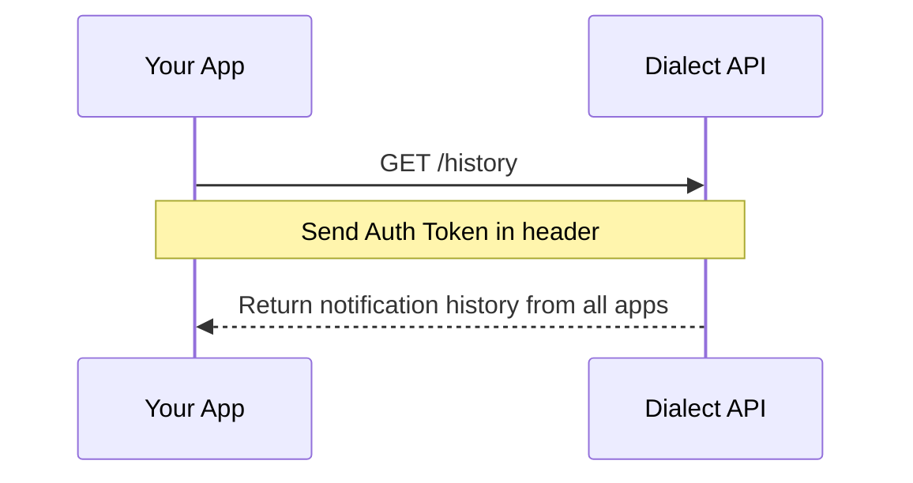

# 🆕 Unified Feed

The Unified Feed allows users to receive notifications from multiple applications in a single feed. This feature combines both in-app alerts and push notifications from all applications the user has subscribed to.

## Authentication

These endpoints require authentication with a user's Bearer token, which is obtained through the [authentication process](./push-notifications/receive-push-notifications.mdx#get-auth-token).

```shell
Authorization: Bearer YOUR_AUTH_TOKEN
```

Additionally, we recommend including the X-Dialect-Client-Key header for identifying your client application:

```shell
X-Dialect-Client-Key: YOUR_CLIENT_KEY
```

You can request a client key from Dialect if you don't have one.

## Get Notification History

You can retrieve a user's notification history from all applications they're subscribed to:



```shell
curl https://alerts-api.dial.to/v2/history \
  --request GET \
  --header 'Authorization: Bearer YOUR_AUTH_TOKEN' \
  --header 'X-Dialect-Client-Key: YOUR_CLIENT_KEY'
```

**Parameters:**

- `appId`: (Optional) Your application's unique identifier. When specified, acts as a filter to show only notifications from that app. If not specified, returns notifications from all apps.
- `limit`: (Optional) Number of notifications to return (default: 25, max: 50)
- `cursor`: (Optional) Pagination cursor for fetching more results

The response will contain a list of notifications and summary information:

```shell
{
  "alerts": [
    {
      "id": "01897d5b-48b5-7b68-94e4-2fa8377a5f78",
      "timestamp": "2024-02-20T15:30:00.000Z",
      "title": "New Message",
      "body": "You have received a new message",
      "image": "https://www.dialect.to/favicon.ico",
      "actions": [
        {
          "type": "link",
          "label": "Open Message",
          "url": "https://dialect.to/message"
        }
      ],
      "topic": {
        "id": "123e4567-e89b-12d3-a456-426614174000",
        "name": "Announcements"
      },
      "app": {
        "id": "255d6163-7e25-43e9-a188-c2f8d0980a4a",
        "name": "Dialect",
        "icon": "https://www.dialect.to/favicon.ico"
      }
    }
  ],
  "summary": {
    "unreadCount": 5,
    "lastRead": {
      "timestamp": "2024-02-20T15:30:00.000Z"
    }
  },
  "limit": 25,
  "cursor": "base64encodedcursor"
}
```

Note: When `appId` is not specified, the response includes additional `app` information for each alert, containing the application's ID, name, and icon.

If you want to test the endpoint, visit the [`/history`](https://alerts-api.dial.to/docs#tag/subscriber/GET/v2/history) endpoint in our API docs.

## Get History Summary

To get a quick summary of a user's notification status:

```shell
curl https://alerts-api.dial.to/v2/history/summary \
  --request GET \
  --header 'Authorization: Bearer YOUR_AUTH_TOKEN' \
  --header 'X-Dialect-Client-Key: YOUR_CLIENT_KEY'
```

The response will contain a summary of the user's notification status:

```shell
{
  "unreadCount": 5,
  "lastRead": {
    "timestamp": "2024-02-20T15:30:00.000Z"
  }
}
```

If you want to test the endpoint, visit the [`/history/summary`](https://alerts-api.dial.to/docs#tag/subscriber/GET/v2/history/summary) endpoint in our API docs.

## Mark Notifications as Read

After a user views their notifications, you can mark them as read:

```shell
curl https://alerts-api.dial.to/v2/history/read \
  --request POST \
  --header 'Authorization: Bearer YOUR_AUTH_TOKEN' \
  --header 'X-Dialect-Client-Key: YOUR_CLIENT_KEY' \
  --header 'Content-Type: application/json' 
```

The response will be an empty JSON object indicating success:

```shell
{}
```

If you want to test the endpoint, visit the [`/history/read`](https://alerts-api.dial.to/docs#tag/subscriber/POST/v2/history/read) endpoint in our API docs. 