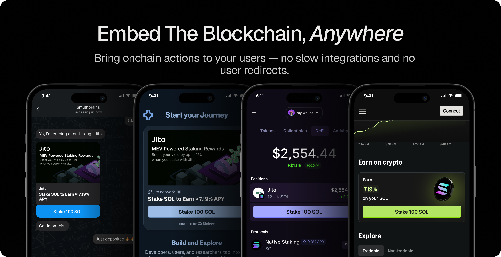
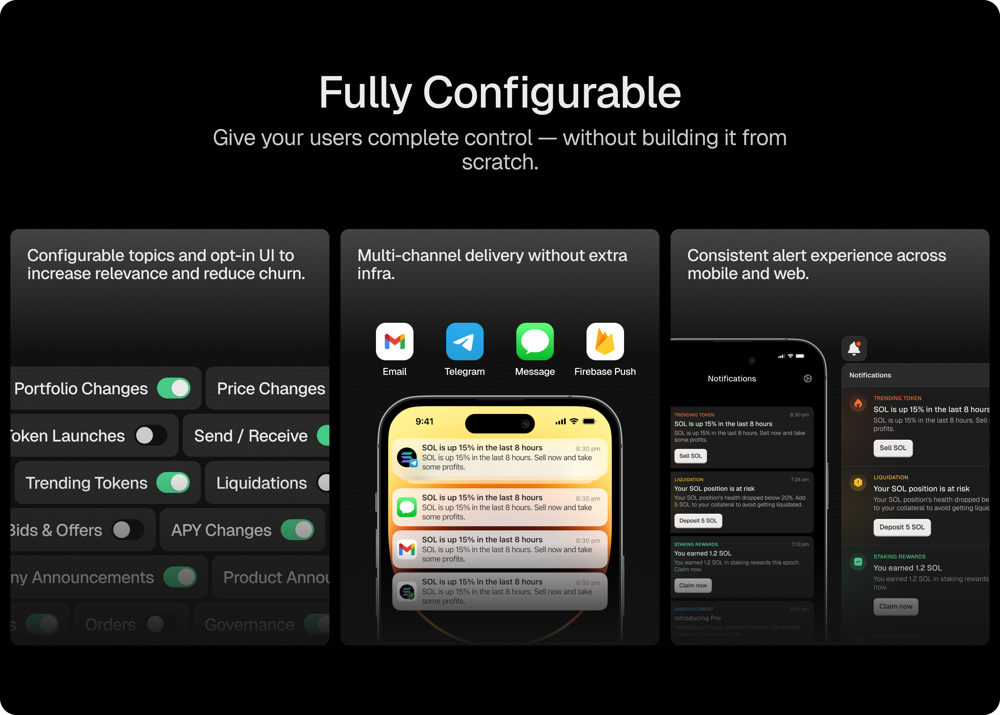

# Developer Documentation

## Blinks

Blockchain Links, aka Blinks, are the fastest way to take onchain experiences and make them distributable and actionable everywhere. This technology lets applications unbundle their product experiences from their apps and sites, allowing users to take instant, no-redirect actions wherever they are.

[Get started with Blinks!](../blinks)

 
## Alerts

Dialect Alerts allow you to send on-chain events via multiple channels directly to your users. This could be critical liquidation event notifications, new offers for their NFTs, limit order execution and much more. We are already powering notifications and messaging for over 30 of the most-loved dApps and wallets on Solana, EVM, and Aptos.

[Send alerts to your users in less than 15 minutes!](../alerts/)

